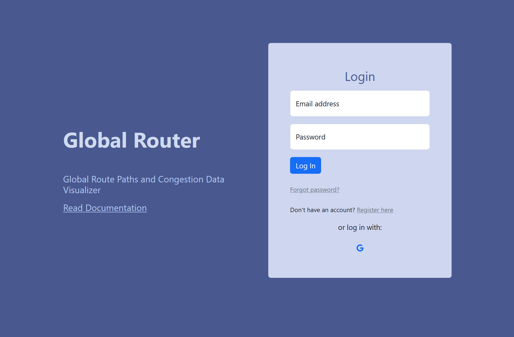
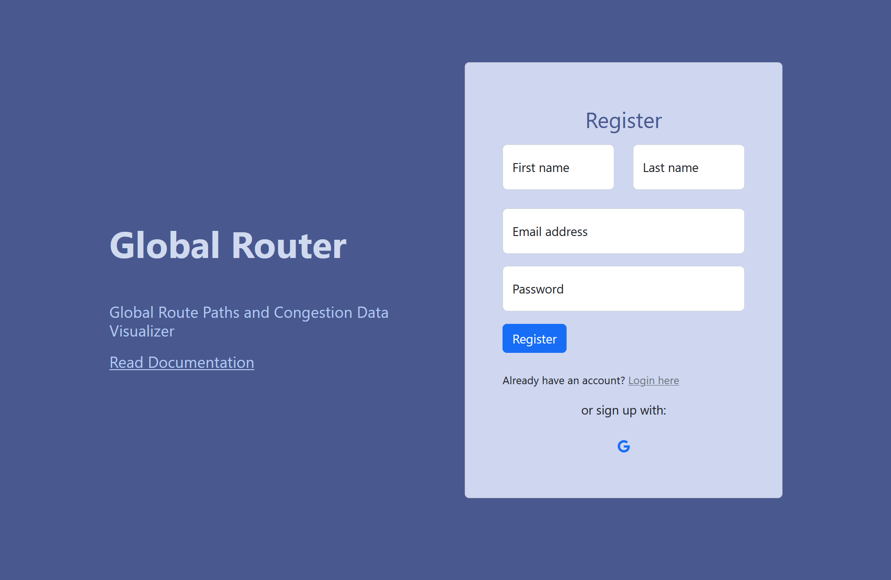
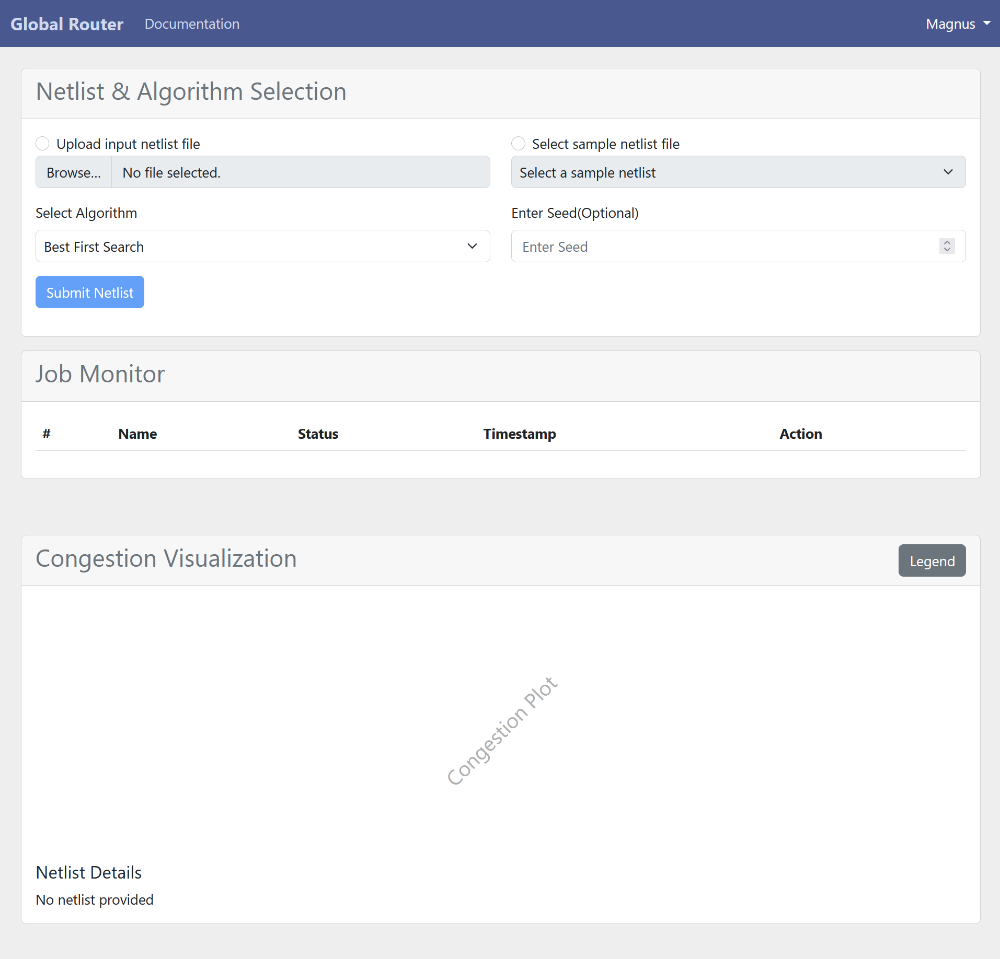
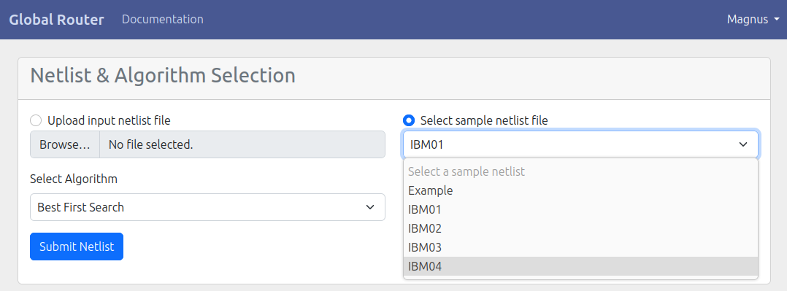
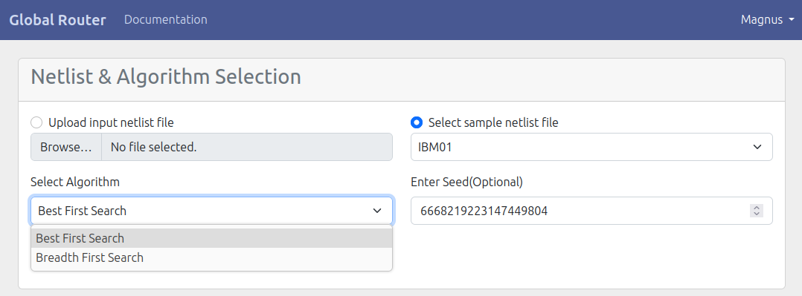
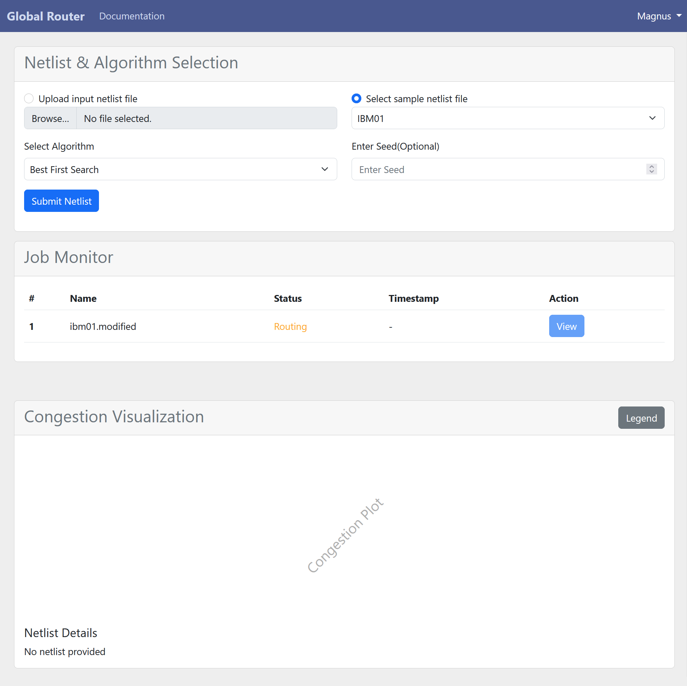
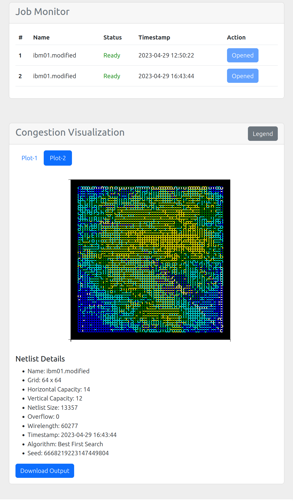
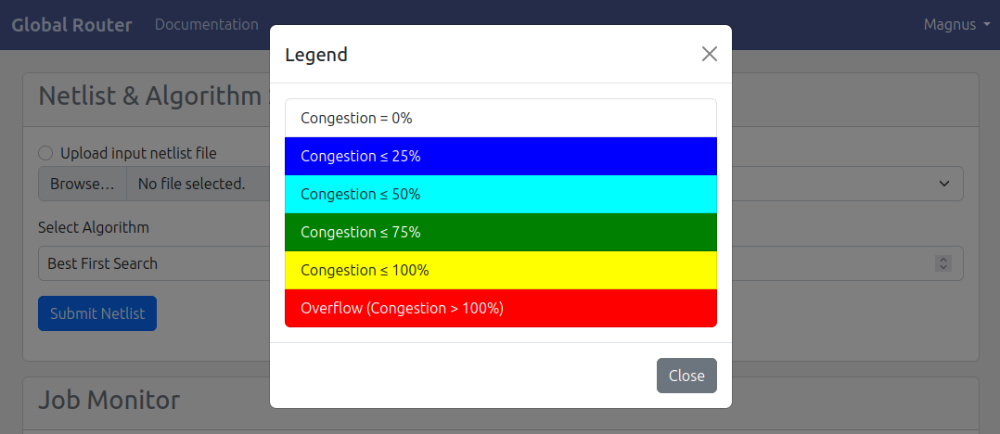

.. _userguide:

User Guide to the Web Application
=================================

This is the main landing page for the web app. The user logs into their account
by simply entering the email and password. Users can also access the documentation by
clicking on the Read Documentation link.

To create an account, the user must provide
their information and complete the registration process. Afterward, they will receive a
prompt to verify their account using the email address they used to sign up.

The user will be directed to the dashboard page. At the top section
of the page, the user will find options to select a netlist input, an algorithm selector,
and a random seed input. The user has the flexibility to either upload their own netlist
file or choose a sample netlist file from the dropdown menu. The random seed input is
used to shuffle and arrange the netlist in a specific order for reproducibility purposes.
Once the selection is made, the user can initiate the routing process by simply clicking
on the ”submit netlist” button.

After submitting a routing job, users can monitor the progress of their request through
the job monitor. This feature displays the job's name, status, completion timestamp,
and provides a convenient button for viewing the output plot.

The congestion visualization section contains a convenient tabbed pane that enables
users to switch between plots of various routing jobs. Within each plot, users can easily
zoom in and out, as well as move the plot around, using intuitive controls.

A handy button to toggle a modal that displays the plot legend. Below the plot,
users can view the netlist details, as well as access a button to download the output file
containing the routed paths.